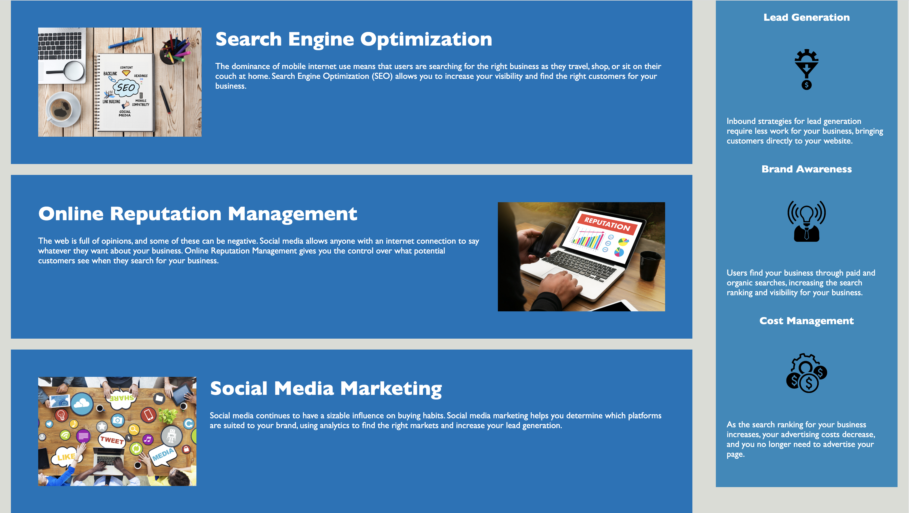

# HTML, CSS, and Git: Code Refactor - Modify Existing Horiseon Webpage


## Description

* As a developer, I wanted to modify and refactor existing code on the Horiseon webpage to make it more organized and accessible to others.


## Acceptance Criteria

```
GIVEN a webpage meets accessibility standards
WHEN I view the source code
THEN I find semantic HTML elements
WHEN I view the structure of the HTML elements
THEN I find that the elements follow a logical structure independent of styling and positioning
WHEN I view the icon and image elements
THEN I find accessible alt attributes
WHEN I view the heading attributes
THEN they fall in sequential order
WHEN I view the title element
THEN I find a concise, descriptive title
```

## Usage

* This webpage can be used to be educated on the accessibility and importance of SEO on websites. See link to deployed webpage below.

* Link: file:///Users/candacegostinski/Desktop/Challenges/Challenge_1/index.html#search-engine-optimization

* Screenshots:
    
    
    


